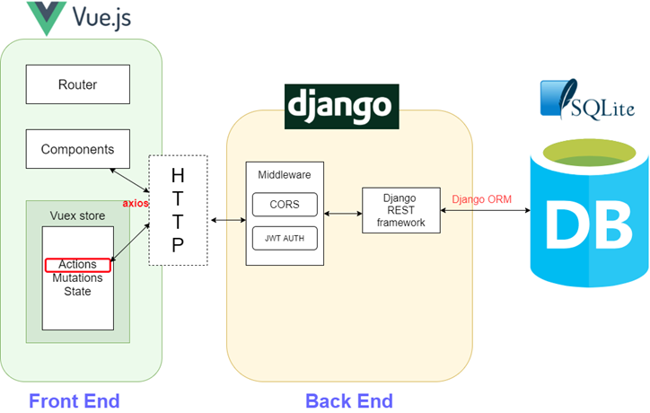
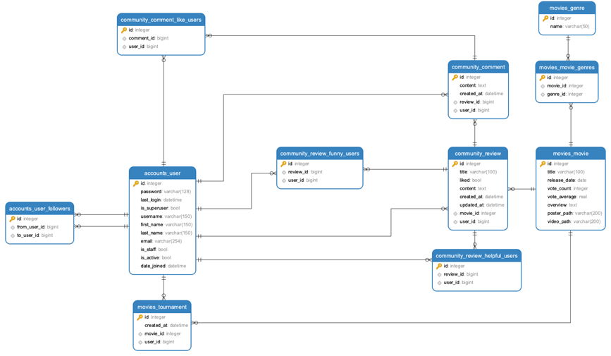
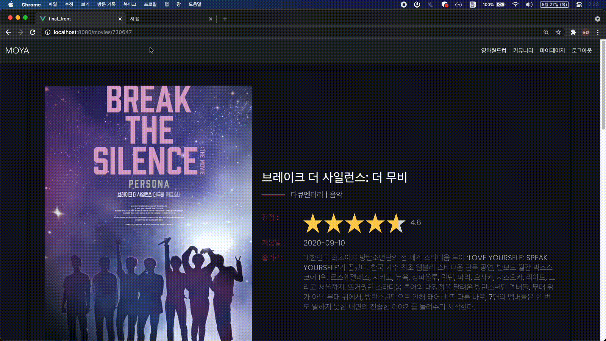

<h1 align="center">Welcome to MOYA👋</h1>


> 영화 정보 기반 추천 서비스 (싸피 5기 최종 프로젝트)

### 🏠 [GithubFront](https://github.com/swhan9404/Moya_Front) 🏠 [GithubBackend](https://github.com/swhan9404/Moya_backend)  🎬[Demo 시연영상](https://youtu.be/jsfDZ9JMc3I)  🎤 [Presentation](https://drive.google.com/file/d/1PF2hjT8MbpQfNdEZ3jxVOH-KQYelCVH3/view?usp=sharing) 👷[블로그](https://velog.io/@swhan9404/series/%ED%94%84%EB%A1%9C%EC%A0%9D%ED%8A%B8Moya)

<br>

- 발표영상

[](https://youtu.be/jsfDZ9JMc3I?t=0s) 


## ✌️ 배포링크

- 프론트(github page로 배포)
  - https://swhan9404.github.io/Moya_Front/
- 백엔드(heroku로 배포)
  - https://moyamoya.herokuapp.com/


## **✨ Description**

```bash
지나가면서 슬쩍 영화를 보고, 
"이 영화 모야? 괜찮은데?"
라는 생각이 들게 만들고 싶다는 소망으로 제작한 영화 정보 커뮤니티 홈페이지 입니다.
```


## 🤼함께 고생한 팀원


## 🔍 서비스 기능

|      | 기능                                     | 기능설명                                                     |
| ---- | ---------------------------------------- | ------------------------------------------------------------ |
| 1    | 반응형 로그인 /회원가입                  | JWT 토큰을 통한 유저 회원가입 및 인증 기능 구현              |
| 2    | 로그아웃                                 | localstorge에 저장한 JWT 토큰 삭제 기능 구현                 |
| 3    | 유저 팔로우                              | 유저간의 팔로우 및 팔로잉 기능 구현                          |
| 4    | 마이페이지 조회                          | 유저 정보, 16강 우승 영화, 좋아요한 영화 목록조회 기능 구현  |
| 5    | tmdb 자료 추출 및 DB화                   | tmdb API의 1400여개의 영화와 19개의 장르 DB화                |
| 6    | 비슷한 장르의 추천 영화 조회             | 해당 영화와 같은 장르를 가지고 있는 영화 중 평점이 높은 순서대로 추천 기능 구현 |
| 7    | 단일 영화 페이지 조회                    | 세부 영화 정보 표현, 트레일러 영상 및 비슷한 영화 추천 기능 구현 |
| 8    | 영화 메인페이지 조회                     | 평점이 높은순, 개봉 예정, 많은 사람이 본 영화순으로 20개씩 슬라이더 와 carousel 로 표현 기능 |
| 9    | 16강 영화월드컵                          | 16개 랜덤 영화추출 및 영화 월드컵 기능 구현                  |
| 10   | 리뷰 생성/ 삭제                          | 특정 영화의 리뷰 생성 기능 및 삭제 구현                      |
| 11   | 댓글 생성/ 삭제                          | 특정 리뷰의 댓글 생성 기능 및 삭제 구현                      |
| 12   | 리뷰 좋아요/재밌어요/도움되요 기능       | 특정 리뷰가 좋아요/재밌어요/도움되요 의 추가 및 삭제 기능 구현 |
| 13   | 댓글 좋아요 기능                         | 특정 댓글의 좋아요 추가 및 삭제 기능                         |
| 14   | 리뷰 전체 페이지 조회                    | 사용자들이 작성한 모든 리뷰들을 카드 형식으로 조회 및 사용자 화면 크기에 따른 갯수 출력 조절 기능 구현 |
| 15   | 단일 리뷰 페이지 조회                    | 리뷰 내용과 댓글 및 좋아요 기능 구현                         |
| 16   | 인피니티 스크롤 기능                     | 리뷰 전체 페이지에서 스크롤을 최하단에 도착할 시 8개씩 리뷰글 추가 조회, throttle로 UX 최적화 |
| 17   | 반응형 아이콘 만들기(하트)               | Anime JS를 활용한 애니메이션과 css tranistion을 통한 폭죽 애니메이션 기능 구현 |
| 18   | gravatar 기능                            | user의 email 기반으로 만드는 아바타 이미지 기능 구현         |
| 19   | UI/UX 생성 시간 조회                     | 사용자를 기준으로 한 상대시간을 표현하여 직관적인 시간 표현 기능 구현 |
| 20   | 비로그인시 next redirect 기능            | JWT 토큰을 기반으로 필수 로그인 페이지 접근시 login 페이지로 보내고 로그인 성공시 원래 가려고 했던 페이지로 push 기능  구현 |
| 21   | 404 페이지 기능                          | 없는 URL로 요청시 404 page로 push 구현                       |
| 22   | 없는 영화, 리뷰 및 유저 페이지 접근 제한 | 동적 라우팅을 사용한 단일 영화, 단일 리뷰, 유저 페이지의 경우 없는 페이지로 접근시 경고창 표시후 main 페이지 이동 기능  구현 |
| 23   | admin페이지                              | Django Admin 을 사용하여 유저, 영화, 리뷰에 대한 정보 제어할 수 있도록 기능 구현 |


## 🔧 Tech Stack




## ✏️ ERD



## 🔍 Overview

### 도입페이지

- 돋보기를 움직이면서 화면을 보여주며

- 지나가면서 슬쩍 영화를 보고, 이 영화 모야? 괜찮은데? 라는 생각을 들게 하는 사이트 MoYa  입니다

  이 입장페이지는 자신에게 맞는 영화를 돋보기처럼 찾아간다는 의미를 담아 만든 페이지입니다.


### 메인페이지

- 맨위의 슬라이더
  - 이 슬라이더는 가장 평점을 높게 받은 영화 20종류를 슬라이더 형식으로 나열해서 사용자가 넘기면서 영화들을 볼 수 있도록 구성하였습니다
  - 해당 영화 포스터에 마우스를 올리면,  제목이 위로 올라가면서 평점과 개봉일자가 표시되고, detail페이지로 이동할 수 있는 버튼이 나옵니다.
- 곧 개봉할 영화, 많은 사람이 본 영화
  - 그 밑에는 곧 개봉할 영화와 많은 사람이 본 영화를 보여주어 가장 관심을 많이 받을 수 있는 영화정보들을 나열하였습니다.
  - 이 것들 또한 슬라이더와 동일하게 마우스를 올리면 애니메이션이 작동합니다.


### 로그인

- 사이트를 더 원활하게 사용할 수 있도록, 로그인을 해보겠습니다. 아직 회원가입을 안한 상태이니 먼저 회원가입을 해야겠죠? Sign Up 과 Sign In 버튼을 누르면 부드럽게 애니메이션이 작동하면서 입력창이 바뀌게 됩니다.

- 회원가입을 하면서 확인 비밀번호와 비밀번호를 다르게 입력해보겠습니다.

  이렇게 아이디가 중복되거나, 비밀번호 확인과 비밀번호를 다르게 치거나 하면서 발생할 수 있는 모든 에러들은 Django에서 보낸 에러코드와 메세지를 참고하여 alert로 출력하게 했습니다. 이것 이외에도 사용자가 겪을 수 잇는 에러들은 전부 이러한 형태로 alert 가 나오게 되고, 해당 작동 코드 중복 작성을 막기위해 mixin을 사용하였습니다.

- 이번엔 정상적으로 회원가입이 완료되면 자동으로 로그인페이지로 이동하는 애니메이션이 작동하고,  로그인을 진행하게 됩니다.


### 영화상세페이지

- 영화 detail 페이지은 크게 3가지 component로 구성되어있습니다.

  상단에는 영화정보, 중간에는 영화 trailer 영상,  맨 밑에는 비슷한 장르의 영화 추천입니다.

  비슷한 영화 장르 추천은, 해당 영화가 가지고 있는 장르들을 가지고 있는 영화 중 평점 상위 20개를 표출하게 됩니다.

- 원래 vue router를 사용하면, 동일 이름의 view 이동시 페이지 전환이 일어나지 않는데,

  router key를 route.fullPath로 하여 주소가 변하면, router가 작동하도록 설정하고, router 가 작동하면 항상 페이지 상단으로 이동하도록 구현하였습니다.


### 리뷰 작성

- 이번에는 리뷰를 작성해보겠습니다. 리뷰 쓰기를 누르면, modal 형태로 리뷰 내용을 작성할 수 있도록 구성하였고, 
- 하단에는 영화의 추천여부를 체크 할 수 있는 라디오 버튼을 구성하였습니다.


### 커뮤니티 

- 리뷰리스트

  - 카드 뷰 형태로 작성하였으며, 상단에는 포스터의 일부, 중간에는 제목과 리뷰내용, 아래에는 해당 리뷰가 영화를 추천하는지와 리뷰의 추천, 댓글의 정보를 표시하도록 하였습니다.
  - 이 부분은 무한스크롤을 적용하여 구현하였으며,  스크롤 이벤트는 너무 많은 이벤트 발생으로 사용자가 부담을 줄 수 있어, 스로틀을 적용하여 사용자의 컴퓨터 부담을 최소화하였습니다.

- 리뷰상세

  - 리뷰를 작성하게 되면, 해당 리뷰의 상세페이지로 이동하게 됩니다.

  - 작성자의 프로필 사진을 gravatar로, 작성 시간을 사용자 편의에 맞게 분, 시간, 일 단위로 보여주게 됩니다.

  - 본문에는 어떤 영화에 대한 것인지 직관적으로 알 수 있도록 포스터와 작성내용이 보여지게 됩니다.

  - 여기에는 3가지 버튼이 있는데, 좋아요 / 재밌어요 / 도움이되었어요 의 의미의 버튼입니다. 스팀의 평가 버튼에 감명을 받아 우리 사이트에도 적용하게 되었습니다.

    버튼을 누르면 아기자기한 이벤트와 함께 데이터 베이스에 반영되게 됩니다.

  - 여기는 해당 영화가 재밌다고 리뷰해주신 분들을 나열했습니다. 이 영화가 얼마나 많은 사람들에게 즐거움을 줬는지 직관적으로 알 수 있도록 구성해보았습니다.

  - 댓글은 마치 우리가 자주 사용하는 카톡과 같은 인터페이스를 구현해보려고 했습니다. 댓글은 작성, 삭제, 좋아요 기능을 사용할 수 있습니다.


### 영화월드컵

- 이 부분은 무작위로 데이터베이스에서 선별된 16개의 영화를 토너먼트 식으로 사용자가 가장 선호하는 영화를 찾을 수 있게 하는 기능입니다.
- 사용자가 아무리 빠르게 많이 클릭을 해도, click 이벤트가 이미지가 바뀌기 전까지 한번의 클릭만 적용되도록 구현하여 에러 발생을 없앴고,
- 사용자가 어떤 영화를 선택했는지 더 직관적으로 볼 수 있도록 흔들리는 애니메이션을 넣었습니다.
- 월드컵에서 우승자가 결정되면 해당 영화의 상세 페이지로 이동하게 됩니다.


### 마이페이지

- gravatar로 만든 프로필사진, 해당 유저의 정보가 보여지게 됩니다.
- 현재는 자기 자신이라 following 버튼이 나타나지 않지만, 다른 유저의 profile 에 가면 following을 할 수 있습니다.
- 밑에는 영화 월드컵 우승작들과, 리뷰로 영화를 좋다고 쓴 영화들의 정보가 나오게 됩니다.


### 안전장치 

#### 로그인 필요한 경우
- 로그인 필요 화면 접근 시 로그인 화면으로 이동 및 로그인 하면 원래 가려고 했던 페이지로 이동 ( vuex 와 vue 생명주기인 create를 이용하여 구현하였습니다)


#### 없는 정보에 접근

- 없는 영화페이지나 review 상세페이지 접근 시 메인페이지로 이동
  - 없는 영화 >> movies/1234456



#### 404page

- 없는 url 링크로 이동시 404 페이지 뜨고, 이전페이지로 가게 만듬
  - 없는 url >> **ssafy**


## 🏃 Steps to run
``` bash
Backend
$ cd final_back
$ python -m venv venv
$ source venv/Scripts/activate
$ python install -r requirements.txt
$ python manage.py loaddata DBdump/0526_movie.json
$ python manage.py loaddata DBdump/0526_accounts.json
$ python manage.py loaddata DBdump/0526_community.json
$ python manage.py runserver
```

``` bash
Frontend
$ cd final_front
$ npm install
$ npm run serve
```


## 🙂 느낀점

- 김윤빈


근래 1년안에 가장 열심히 달렸던 한주라고 평가 할 수 있을꺼 같습니다. 싸피에 들어와서 난생 처음 배우는 뷰와 장고들을 이용해 한학기를 마무리 하는데에 있어서 배우는 것만 사용하는 것에 그치지 않고 만들고 싶은 기능들과 기술들을 스스로 찾아보고 수 많은 에러들을 만나면서 하나하나 배워나갈 수 있었습니다. 프로젝트를 하면서 처음에는 모르면 교수님에게 도움을 요청했는데, 그렇지 못한 상황들이 더 많았고 그 상황을 해결하려는 실력 또한 많이 늘었다고 생각합니다. 또한 처음 해본 일 또한 자신감 있게 할 수 있는 기회를 얻었다고 느끼는 부분도 많았습니다. 특히나 처음 도전해본 영상 제작을 맡으면서 많은 부분을 배울 수 있는 프로젝트라 뿌듯합니다. 

- 한승운

프로젝트를 하면서 다양한 문제들을 마주하게 되었다. 그 문제를 마주하며 지금까지 배운내용을 되돌아보게도 되고, 새로운 내용을 배울 수 있는 기회가 되었다. 스스로도 프로젝트를 하기 전과 후를 비교했을 때 성장한 자신을 발견할 수 있었다.


이번 프로젝트에 욕심을 많이 부려서 일주일이라는 시간 내에 정말 많은 양의 내용을 구현하게 되었다. 이런 나의 욕심을 버텨준 윤빈이에게 많은 고마움을 느낀다. 내가 이번 프로젝트가 좋은 경험으로 남았듯이 윤빈이도 좋은 경험으로 남았으면 좋겠다.
